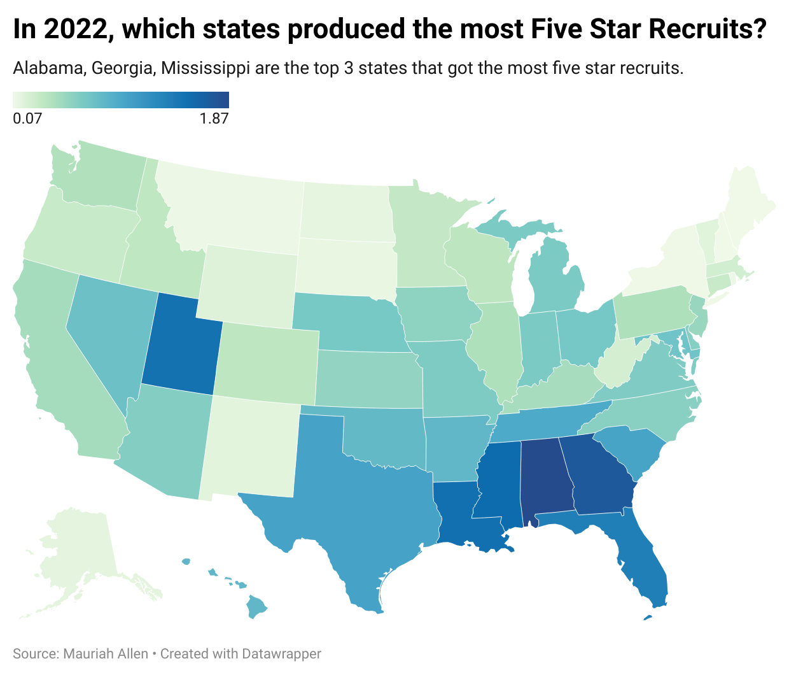
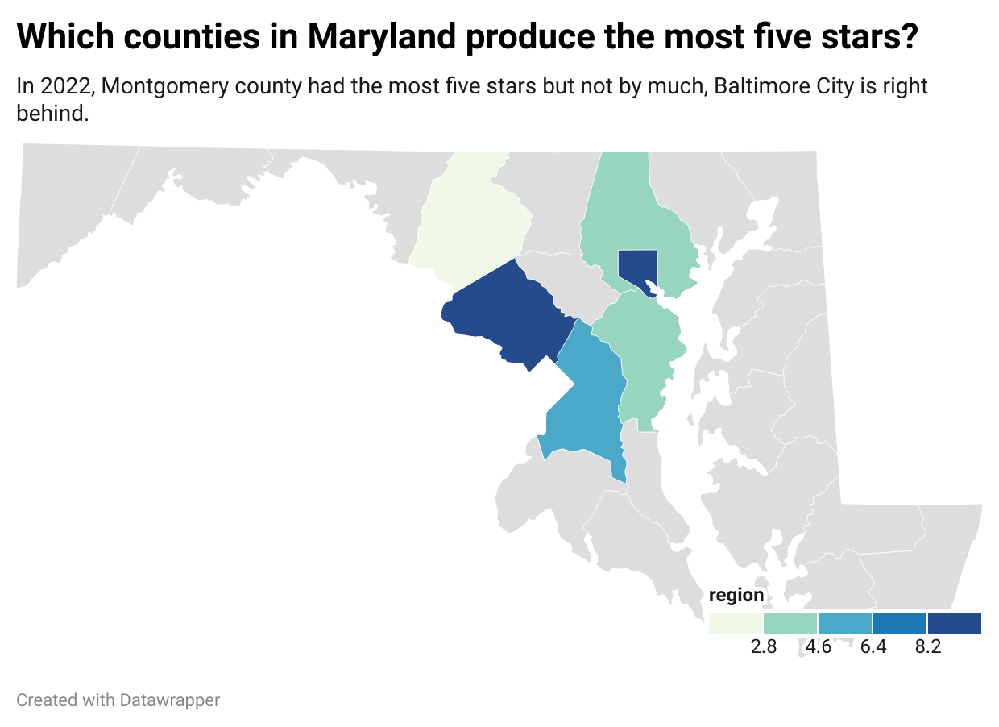

```{r}
if (!requireNamespace('pacman', quietly = TRUE)){
  install.packages('pacman')
  
}
pacman::p_load_current_gh("sportsdataverse/recruitR")
```

This analysis aims to explore key questions about five-star high school football recruits: Where do these elite athletes typically come from? Which colleges attract the most five-star talent, and which schools fall short?

A special focus will be placed on Maryland, examining which counties produced the most five-star athletes in 2022 and identifying the positions for which the state is most recognized.

The data highlights trends from the year 2022, though it does not include performance metrics for these athletes during their rookie college seasons. This approach provides a snapshot of high school talent pipelines and their connections to college football programs.

Here's how I got my data:

**loading data :**

```{r}
library(recruitR)
library(dplyr)
library(ggplot2)
library(tidyverse)
library(maps)
library(tidycensus)
library(sf)
library(ggthemes)
```

**loading keys:**

```{r}
logs22 <- cfbd_recruiting_player(2022, recruit_type = 'HighSchool')

```

```{r}

 census_api_key("f22effc123f29363710a1dc30b8649ced6732b8f", install = TRUE, overwrite=TRUE)


states <- get_acs(geography = "state", 
                  variables = c(totalpop = "B01003_001"), 
                  year = 2022)
```

**Creating a data frame for state abbreviations and** **names:**

```{r}
statedata <- tibble(NAME = state.name) |>
   bind_cols(tibble(state_province = state.abb)) |>
   bind_rows(tibble(NAME = "District of Columbia", state_province = "DC"))

```

**Joining dataframes:**

```{r}
logs22 <- left_join(statedata, logs22, by = "state_province")

logs22 <- logs22<- left_join(states, logs22, by = "NAME")
```

```{r}
logs22 <- logs22 |> group_by(stars = '5', name,NAME ,school, committed_to,ranking, position,city, state_province, estimate) |> summarise(count=n())


```

**Creating five star data:**

```{r}
fivestars22 <- logs22 |> group_by(NAME, estimate) |> summarise(count= n()) |> mutate(per_capita = count/estimate*100000)

```

```{r}
write.csv(fivestars22, file = "fivestars_22.csv")
view()
```



The production of five-star high school football recruits varies significantly across states, according to an analysis of data from the year 2022. Despite having smaller populations, southern states like Alabama and Georgia lead the nation in five-star athlete production rates.

In 2022, Alabama, with a population of around 5 million, produced 94 five-star recruits, resulting in a rate of 1.8 recruits per 100,000 residents. Georgia ranked second, generating 186 five-stars from its nearly 10 million residents, achieving a rate of 1.86 recruits per 100,000 people. Mississippi, despite having fewer total recruits (46), boasted a rate of 1.53 per 100,000 residents from its population of nearly 3 million.

In contrast, populous states like California didn't generate five-star recruits at comparable rates. California, with almost 39 million residents, had 117 five-star recruits in 2022, translating to a modest rate of 0.4 per 100,000 residents. This discrepancy highlights that states with strong football traditions often outperform larger states in producing elite talent.

**Creating data to show where the five star recruits went:**

```{r}
newlog <- cfbd_recruiting_player(2022, recruit_type = 'HighSchool')|> na.omit()
```

```{r}
newlog <- newlog |>group_by(stars = '5', committed_to)|>summarise(count=n()) 

newlog <- newlog |> filter(count > 20)
```

```{r}
ggplot() + 
  geom_bar(
    data=newlog, 
    aes(x=reorder(committed_to, count),
        weight=count)) + 
  labs(
    title="Where did Five Star Recruits go in 2022?",
    subtitle = "Texas A&M dominated the scale in the 2022 season",
    x="Scool", 
    y="Recruits") + 
  theme_minimal() + 
  coord_flip() 
```

Colleges in the South dominate when it comes to signing five-star recruits. Programs like Texas A&M, Georgia, Vanderbilt, and Texas led the pack in 2022, securing many of the nation’s top players. These schools consistently attract elite talent due to their successful football programs, strong coaching staffs, and established recruiting pipelines.

**Looking at the state of Maryland:**

```{r}
mdlogs22 <- cfbd_recruiting_player(2022, recruit_type = 'HighSchool', state = "MD") |> na.omit()

mdlogs22 <- mdlogs22 |> group_by(stars = '5', city) |> summarise(count=n())

write.csv(mdlogs22, file = "mdlogs.csv")
```



Focusing on Maryland, only six counties contributed five-star athletes from 2020 to 2023. Montgomery County led the way with 10 recruits, followed by Baltimore City with nine. Prince George’s County produced six, Anne Arundel four, Baltimore County three, and Frederick County one. Notably, cornerbacks and defensive linemen emerged as the most common positions for Maryland’s five-star recruits.

**What positions were five stars in Maryland?**

```{r}
md22 <- cfbd_recruiting_player(2022, recruit_type = 'HighSchool', state = "MD") |> na.omit()

md22 <- md22 |> group_by(stars = '5', position) |> summarise(count=n())
```

```{r}
ggplot() + 
  geom_bar(
    data=md22, 
    aes(x=reorder(position, count),
        weight=count)) + 
  labs(
    title="Five Stars in Maryland by Position", 
    x="Positions", 
    y="Players") + 
  theme_minimal() + 
  coord_flip()
```

Cornerbacks are the crown jewel of Maryland’s football pipeline in 2022, as the state gained recognition for producing top-tier talent in this position. Defensive players, in general, dominated the spotlight, with Maryland churning out more five-star defensive linemen than wide receivers, underscoring its reputation as a defensive stronghold.

The analysis shows that climate, population size, and football culture play crucial roles in producing five-star athletes. In 2022 warmer states like Florida and Texas continued to dominate, while colder states like Nebraska rarely make an impact. This disparity underscores the importance of regional traditions and investment in high school football.

Looking ahead, a deeper dive into rookie-season performance could shed light on how well these recruits transition to the college level, offering further insights into the success of high school talent development.
